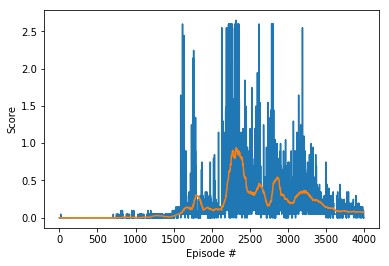

### Using Deep Deterministic Policy Gradients to Optimize Multiple Observation-Exclusive Agents

The algorithm uses a deep deterministic policy gradients (DDPG) adjusted to a multi-agent case. In this algorithm, 
there is an actor and a critic, each with a local approximation and a target approximation. It applies soft-updates, 
slowly blending the local network weights with the target network weights, and applies noise to its actions to add 
stochasticity.

The hyperperameters are fairly standard, with a gamma of 0.99 and very small learn rates. I adjusted the noise down a little, 
but I think this measure will be worth experimenting more with the most because it allows the objective function to be more 
or less exploratory. The neural networks have two fully connected hidden layers, each with 256 nodes. There's also a line of 
gradient clipping to stabilize the learning.

I chose to save the weights of the highest average deque of 100 scores, as opposed to simply saving the weights obtained from 
the highest scoring episode. The reasoning is that the highest scoring epsiode, in this specific, unstable environment, will 
often be a peak with steep gradients on either of side of it. Parameters saved from this weight could allow the agent to 
perform very well under certain conditions or by chance, but any action taken by the agent removed from the conditions in 
which it scored so highly may cause it to fall off the cliff and fail.

Saving the highest average of a deque also isn't perfect, as the save comes at the rightmost edge of that score window, and 
can drop off by some amount in the following episode that's outside that scoring window. Yet, it still is more reliable than 
saving on the highest scoring episode.

Looking at the performance of the trained agent, it did very well in episode 1 and 2, but in episode 2, 3, and 4 it did 
poorly, falling under the 0.5 score threshold set. It can be seen where the parameter weights were saved by looking at the 
plot of scores during the agent's online learning. Remember that the scores were saved on the rightmost edge of the deque. 
Looking at the right periphery of that likely window of 100 scores, we can see a drop-off in performance. There are also 
probably dips in performance within that window that can't be visualized with that plot.

This same agent, under these same hyperparameters can be trained again, and the results can be wildly different. A lot of it 
is up to chance, but, with persistence, the learning can be smoothed out to some degree and better can be performance 
achieved; however, the learning will always have instability with a multi-agent environment in which the agents interact with 
each other.

We can imagine some variations on the reward structure and the environment as a whole. The current reward structure can be 
seen as a cooperative one, but if an agent were to receive a bonus reward when the opposing agent fails to return a ball that 
landed in bounds, then the nature of the learning would change, given that the two agents didn't share neural networks. They 
would try to exploit patterns in the opposing agent until both neural networks converged and played perfectly, in theory. Or, 
imagine that each agent has a limited observation range so they can't see the ball unless it is close to them. Small 
variations in the environment will completely change how the agents interact with each other and how they learn.
